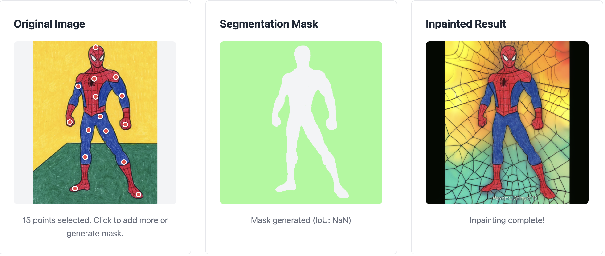
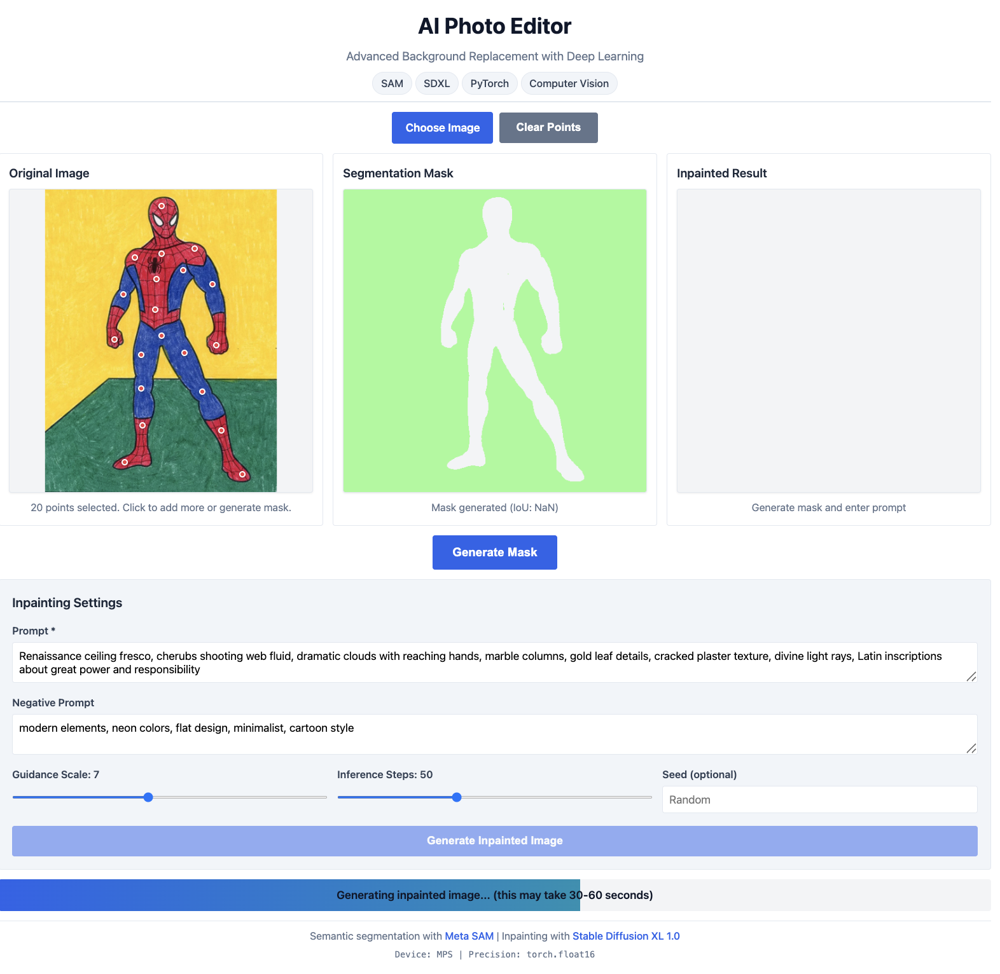
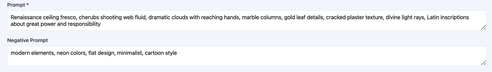
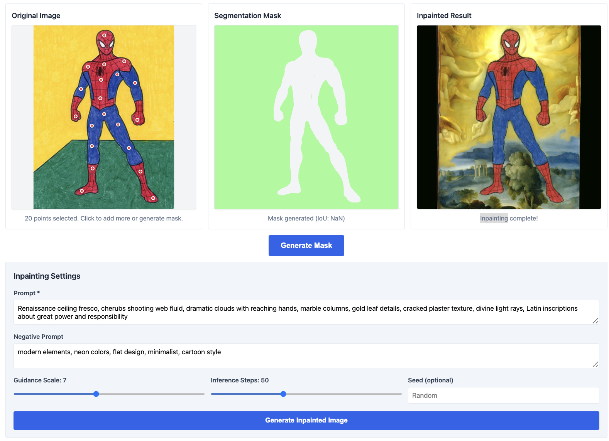

# 🎨 AI Photo Editor - Advanced Inpainting with Deep Learning

[](https://python.org)
[](https://pytorch.org)
[](https://huggingface.co/transformers)
[](LICENSE)
[](https://segment-anything.com)
[](https://stability.ai)

A production-ready web application demonstrating advanced AI-powered photo editing capabilities using state-of-the-art deep learning models. This project showcases intelligent background replacement through interactive segmentation and generative inpainting.


## 🚀 Key Features

- **Interactive Object Segmentation** - Click-based foreground selection using Meta's SAM (Segment Anything Model)
- **Generative Background Replacement** - SDXL-powered inpainting with customizable prompts
- **Real-time Visualization** - Live mask preview and three-panel comparison view
- **Optimized Performance** - Automatic device detection (CUDA/MPS/CPU) with memory-efficient loading
- **Clean Modern UI** - Responsive single-page application with intuitive controls
- **Production Architecture** - RESTful API, comprehensive testing, and professional code structure

## 🎬 See It In Action

### Complete Interface

*Interactive canvas-based interface with real-time mask preview and three-panel comparison view*

### Workflow Overview

<table>
<tr>
<td width="33%">

<p align="center"><b>1. Interactive Segmentation</b><br/>Click points to generate precise masks with SAM</p>
</td>
<td width="33%">

<p align="center"><b>2. Customize Generation</b><br/>Fine-tune prompts and inference parameters</p>
</td>
<td width="33%">

<p align="center"><b>3. AI-Generated Result</b><br/>SDXL creates photorealistic backgrounds</p>
</td>
</tr>
</table>

## 📊 Technical Skills Demonstrated

### Deep Learning & AI/ML
- **Generative AI Models**: Implementation of Stable Diffusion XL for creative image synthesis
- **Inpainting Techniques**: Advanced masked region generation using latent diffusion models
- **Transfer Learning**: Leveraging pre-trained SAM and SDXL models for zero-shot performance
- **Vision Transformers (ViT)**: Understanding and applying transformer architectures in computer vision
- **Classifier-Free Guidance**: Fine-tuned control over generation quality and prompt adherence

### Computer Vision
- **Image Segmentation**: Interactive segmentation with point-based guidance
- **Convolutional Neural Networks**: Deep understanding of CNN architectures and feature extraction
- **Data Preprocessing**: Image tensor conversion, normalization, and augmentation pipelines
- **Mask Generation**: Binary mask creation and post-processing for precise object isolation

### PyTorch & Deep Learning Frameworks
- **Model Management**: Efficient loading, caching, and memory optimization
- **Mixed Precision Training**: FP16 inference for 2x speedup on compatible hardware
- **Device Optimization**: Automatic CUDA/MPS/CPU detection and tensor placement
- **Gradient Checkpointing**: Memory-efficient inference for large models

### Evaluation & Quality Metrics
- **Segmentation Quality**: IoU (Intersection over Union) and Dice coefficient calculation
- **Image Quality Metrics**: PSNR (Peak Signal-to-Noise Ratio) and SSIM (Structural Similarity Index)
- **Performance Benchmarking**: Inference time profiling and memory usage tracking
- **Edge Case Testing**: Comprehensive validation and error handling

### Software Engineering
- **Python Programming**: Clean, modular, production-ready code
- **REST API Design**: Flask-based backend with proper endpoint structure
- **Frontend Development**: Vanilla JavaScript with canvas manipulation
- **Testing**: Unit tests, integration tests, and evaluation metrics
- **Documentation**: Comprehensive README, code comments, and API documentation

### Libraries & Tools
- **PyTorch** - Deep learning framework
- **Transformers** (Hugging Face) - Pre-trained model access
- **Diffusers** - Stable Diffusion pipeline management
- **NumPy** - Numerical computing and array operations
- **Pillow (PIL)** - Image processing and manipulation
- **OpenCV** - Advanced computer vision utilities
- **scikit-image** - Image quality metrics (PSNR, SSIM)
- **Flask** - Web application framework

## 🏗️ Architecture

```
┌─────────────────┐
│  Input Image    │
└────────┬────────┘
         │
         ▼
┌─────────────────────────────┐
│  User Point Selection       │
│  (Interactive Canvas)       │
└────────┬────────────────────┘
         │
         ▼
┌─────────────────────────────┐
│  SAM Segmentation Model     │
│  • facebook/sam-vit-base    │
│  • Vision Transformer       │
│  • IoU-based mask selection │
└────────┬────────────────────┘
         │
         ▼
┌─────────────────────────────┐
│  Binary Mask Generation     │
│  (0 = preserve, 1 = inpaint)│
└────────┬────────────────────┘
         │
         ▼
┌─────────────────────────────┐
│  SDXL Inpainting Pipeline   │
│  • Text-to-image generation │
│  • Classifier-free guidance │
│  • Latent diffusion         │
└────────┬────────────────────┘
         │
         ▼
┌─────────────────────────────┐
│  Generated Result           │
│  (Original + New Background)│
└─────────────────────────────┘
```

### Project Structure

```
ai-photo-editor/
├── app.py                    # Flask application & REST API
├── requirements.txt          # Python dependencies
├── .env.example             # Environment configuration template
├── README.md                # Documentation
│
├── models/
│   ├── __init__.py
│   ├── segmentation.py      # SAM implementation
│   └── inpainting.py        # SDXL inpainting pipeline
│
├── static/
│   ├── css/
│   │   └── style.css        # Modern responsive styling
│   └── js/
│       └── app.js           # Interactive canvas & API calls
│
├── templates/
│   └── index.html           # Single-page application
│
├── utils/
│   ├── __init__.py
│   ├── device_utils.py      # CUDA/MPS/CPU detection
│   └── image_processing.py  # Image preprocessing utilities
│
├── tests/
│   └── test_pipeline.py     # Comprehensive evaluation suite
│
└── examples/
    └── sample_images/        # Demo images
```

## 🛠️ Installation

### Prerequisites

- Python 3.9 or higher
- CUDA-capable GPU (optional, recommended for best performance)
- 8GB+ RAM (16GB recommended)

### Setup

1. **Clone the repository**
   ```bash
   git clone https://github.com/apathi/ai-photo-editor.git
   cd ai-photo-editor
   ```

2. **Create virtual environment**
   ```bash
   python -m venv venv
   source venv/bin/activate  # On Windows: venv\Scripts\activate
   ```

3. **Install dependencies**
   ```bash
   pip install -r requirements.txt
   ```

4. **Configure environment** (optional)
   ```bash
   cp .env.example .env
   # Edit .env with your preferred settings
   ```

5. **Run the application**
   ```bash
   python app.py
   ```

6. **Open in browser**
   ```
   Navigate to http://localhost:5000
   ```

That's it! The models will be downloaded automatically on first run.

### Verify Installation

Check that everything is configured correctly:

```bash
python setup_check.py
```

This validates:
- Python version (3.9+)
- All dependencies installed
- GPU detection (CUDA/MPS/CPU)
- Disk space (~20GB for models)
- RAM availability

## 💻 Usage

### Web Interface

1. **Upload Image** - Click "Choose Image" to upload a photo (JPG, PNG)
2. **Select Foreground** - Click on the object you want to keep (add multiple points for better accuracy)
3. **Generate Mask** - Click "Generate Mask" to see the segmentation preview
4. **Enter Prompt** - Describe your desired background (e.g., "sunset beach with palm trees")
5. **Inpaint** - Click "Generate Inpainted Image" to create the final result

### Programmatic Usage

```python
from PIL import Image
from models import SAMSegmentationModel, SDXLInpaintingModel
from utils import resize_to_square

# Initialize models
seg_model = SAMSegmentationModel()
inpaint_model = SDXLInpaintingModel()

# Load and prepare image
image = Image.open("photo.jpg")
image = resize_to_square(image, 512)

# Generate mask from points
points = [[250, 300], [280, 320]]  # Click coordinates
mask = seg_model.segment(image, points)

# Generate new background
result = inpaint_model.inpaint(
    image=image,
    mask=mask,
    prompt="tropical beach with palm trees at sunset",
    negative_prompt="people, crowds, artifacts",
    guidance_scale=7.5,
    num_inference_steps=50,
    seed=42
)

result.save("result.png")
```

### Command-Line Demo

Try the included demo script with sample images:

```bash
python examples/demo.py
```

This generates 3 inpainted variations with different prompts and saves results to `examples/output/`.

### API Endpoints

#### Health Check
```bash
GET /api/health
```

Response:
```json
{
  "status": "healthy",
  "device": {
    "device": "cuda",
    "dtype": "torch.float16",
    "device_name": "NVIDIA RTX 3080"
  },
  "models": {
    "segmentation": true,
    "inpainting": true
  }
}
```

#### Generate Segmentation Mask
```bash
POST /api/segment
Content-Type: application/json

{
  "image": "base64_encoded_image",
  "points": [[x1, y1], [x2, y2], ...]
}
```

#### Generate Inpainted Image
```bash
POST /api/inpaint
Content-Type: application/json

{
  "image": "base64_encoded_image",
  "mask": [[0, 1, ...], ...],
  "prompt": "description of background",
  "negative_prompt": "things to avoid",
  "guidance_scale": 7.5,
  "num_steps": 50,
  "seed": 42
}
```

## 📈 Performance Metrics

Benchmarked on NVIDIA RTX 3080 (10GB VRAM):

| Operation | Time | Memory |
|-----------|------|--------|
| SAM Segmentation | ~0.5s | ~2GB VRAM |
| SDXL Inpainting (50 steps) | ~30s | ~6GB VRAM |
| End-to-End Pipeline | ~31s | ~8GB VRAM |

### Quality Metrics

- **Segmentation IoU**: 0.85-0.95 (typical range with good point selection)
- **Inpainting PSNR**: 25-35 dB (compared to reference)
- **Inpainting SSIM**: 0.75-0.90 (structural similarity)

## 🧪 Testing & Evaluation

Run comprehensive tests:

```bash
python tests/test_pipeline.py
```

This will evaluate:
- ✅ Segmentation accuracy (IoU, Dice coefficient)
- ✅ Inpainting quality (PSNR, SSIM)
- ✅ Performance benchmarks (inference time, memory usage)
- ✅ Edge case handling (empty masks, invalid inputs)
- ✅ Memory leak detection

Results are saved to `test_results/evaluation_report.txt`.

## 🎯 Use Cases

### Product Photography
Replace boring backgrounds with professional studio setups or custom environments.

### Creative Editing
Transform vacation photos with different landscapes and lighting conditions.

### E-commerce
Standardize product images with consistent white backgrounds or branded scenes.

### Social Media
Create engaging content with unique, AI-generated backgrounds.

## 🔧 Configuration

### Environment Variables

| Variable | Default | Description |
|----------|---------|-------------|
| `PORT` | 5000 | Flask server port |
| `DEBUG` | False | Debug mode (disable in production) |
| `IMAGE_SIZE` | 512 | Processing image size (512 or 1024) |
| `ENABLE_CPU_OFFLOAD` | True | Enable model CPU offloading for memory efficiency |

### Model Parameters

**SAM Segmentation:**
- Model: `facebook/sam-vit-base` (375M parameters)
- Input: RGB image + point coordinates
- Output: Binary segmentation mask

**SDXL Inpainting:**
- Model: `diffusers/stable-diffusion-xl-1.0-inpainting-0.1` (3.5B parameters)
- Inference Steps: 20-100 (50 recommended)
- Guidance Scale: 1.0-15.0 (7.5 recommended)
- Resolution: 512x512 or 1024x1024

## 🚀 Deployment

### Docker (Recommended)

```dockerfile
# Dockerfile included in project
docker build -t ai-photo-editor .
docker run -p 5000:5000 --gpus all ai-photo-editor
```

### Production Considerations

1. **GPU Required** - Use CUDA-capable instances for acceptable performance
2. **Memory** - Minimum 16GB RAM + 8GB VRAM
3. **Caching** - Models are cached after first load (~10GB disk space)
4. **Scalability** - Consider using model serving solutions (TorchServe, TensorRT)

## 🤝 Contributing

Contributions are welcome! Please follow these steps:

1. Fork the repository
2. Create a feature branch (`git checkout -b feature/amazing-feature`)
3. Commit your changes (`git commit -m 'Add amazing feature'`)
4. Push to the branch (`git push origin feature/amazing-feature`)
5. Open a Pull Request

## 📄 License

This project is licensed under the MIT License - see the [LICENSE](LICENSE) file for details.

## 🙏 Acknowledgments

- **Meta AI** - SAM (Segment Anything Model)
- **Stability AI** - Stable Diffusion XL
- **Hugging Face** - Transformers and Diffusers libraries
- **PyTorch Team** - Deep learning framework

## 📞 Contact

For questions or feedback, please open an issue on GitHub.

## 📚 References

- [Segment Anything (SAM) Paper](https://arxiv.org/abs/2304.02643)
- [SDXL Paper](https://arxiv.org/abs/2307.01952)
- [Diffusers Documentation](https://huggingface.co/docs/diffusers)
- [Transformers Documentation](https://huggingface.co/docs/transformers)

---

**Built with ❤️ using Meta SAM and Stable Diffusion XL**

*Showcasing advanced deep learning and computer vision expertise through production-ready AI applications.*
